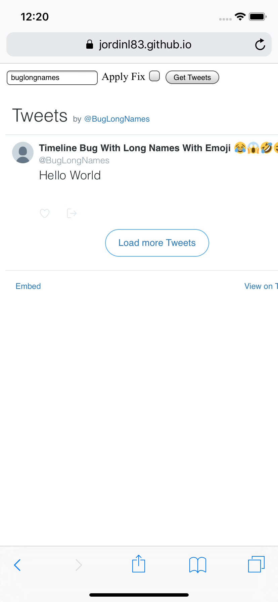
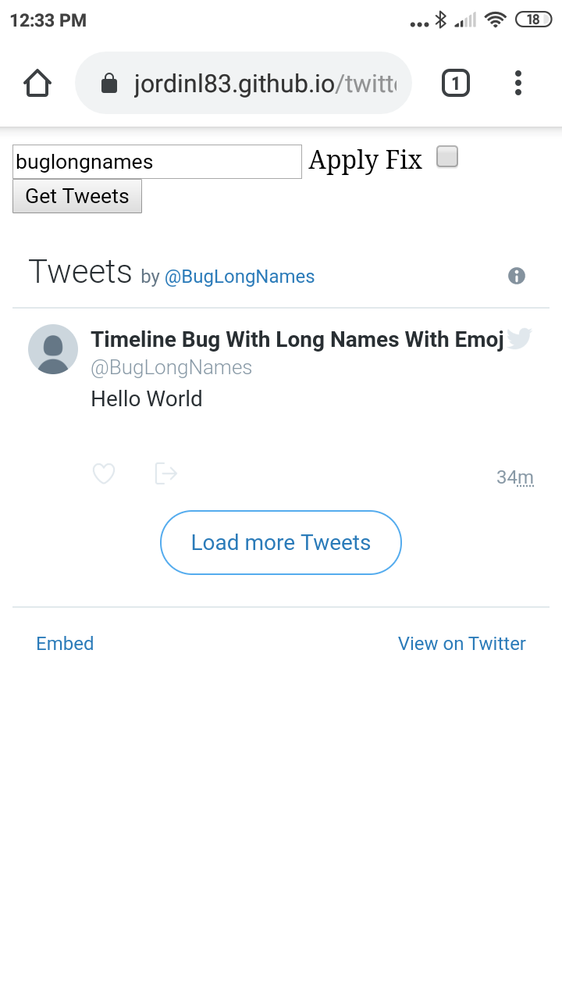
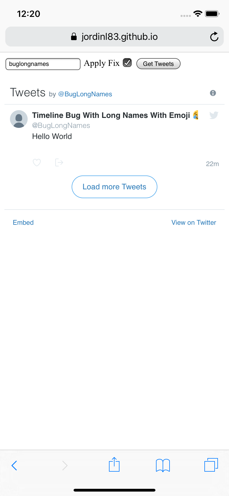
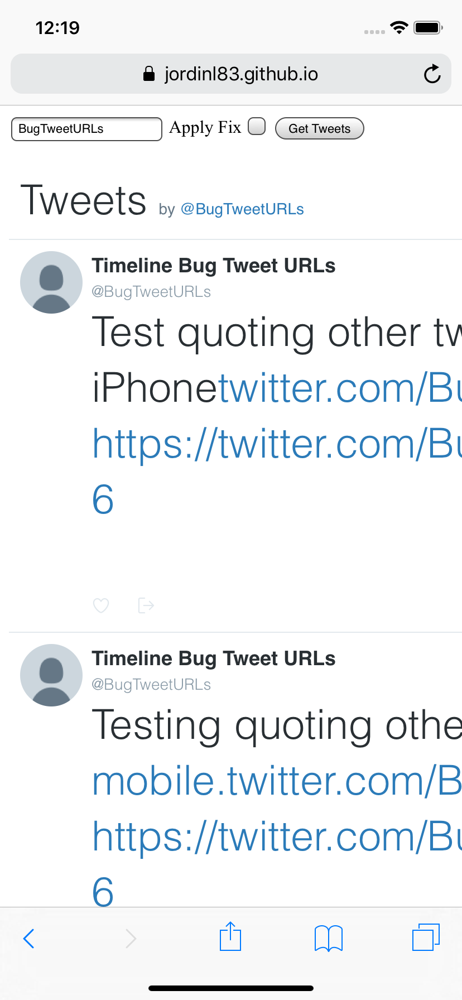
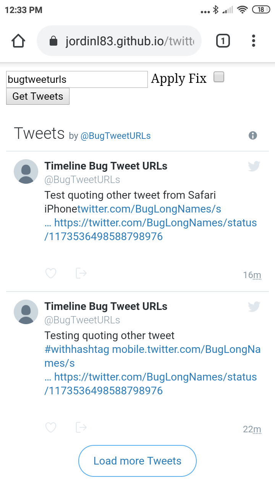
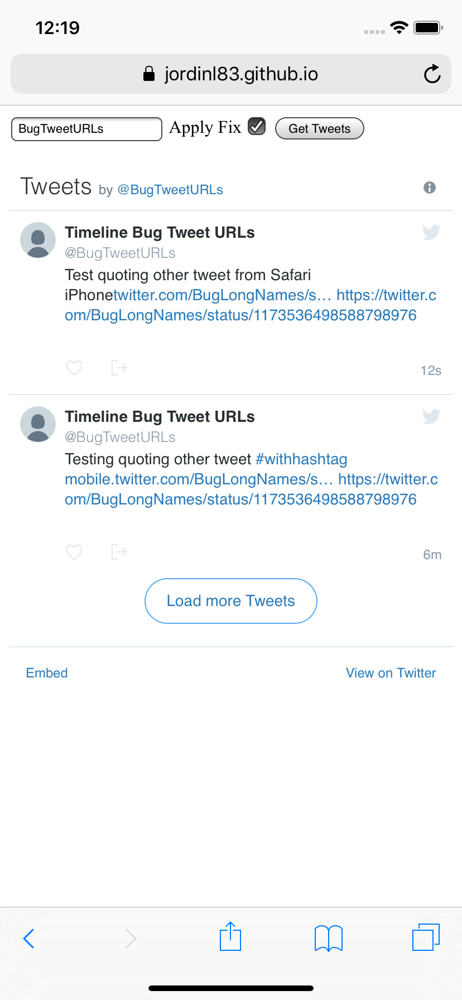

# twitter-timeline-bug

### Embedding the Twitter Timeline breaks site layout in Safari iPhone under some circumstances.

#### Twitter Names that are long and contain emoji (this does not seem to happen when the name is long but does not contain emoji)


| Safari iPhone | Chrome Android | "Fix" for Safari iPhone |
| --- | --- | --- |
|  |  |  |

The bug in action can be seen here: https://jordinl83.github.io/twitter-timeline-bug/?user=BugLongNames
<br/>
And the fix here: https://jordinl83.github.io/twitter-timeline-bug/?user=BugLongNames&fix=1

#### Tweets that link to other tweets

| Safari iPhone | Chrome Android | "Fix" for Safari iPhone |
| --- | --- | --- |
|  |  |  |

Note that there's another issue when quoting another tweet, the tweet URL appears twice...

The bug in action can be seen here: https://jordinl83.github.io/twitter-timeline-bug/?user=BugTweetURLs
<br/>And the fix here: https://jordinl83.github.io/twitter-timeline-bug/?user=BugTweetURLs&fix=1

### FIX

This is more a hack than a fix, but a way around this issue would be to add the following style to the embedded tweets iframe:

```css
.TweetAuthor { max-width: 300px; text-overflow: ellipsis; }
.timeline-Tweet-text a:not(.customisable) { word-break: break-all; }
```

This needs to be done with JS, see [here](https://github.com/jordinl83/twitter-timeline-bug/blob/master/index.html#L37-L52) for how it can be accomplished.
